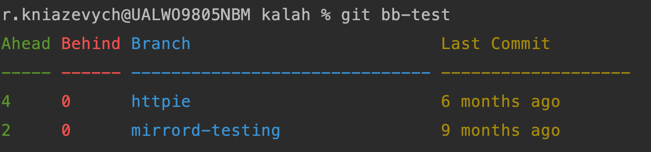
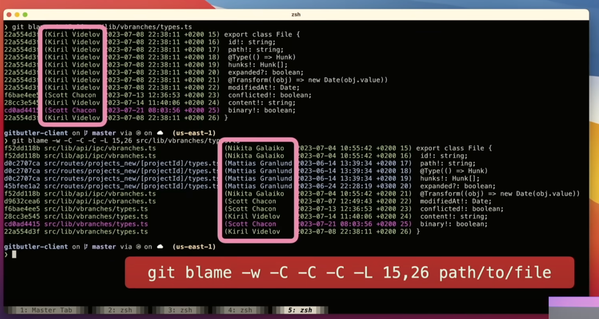
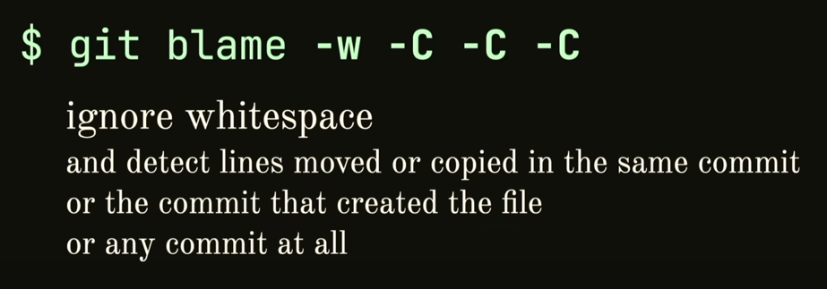

# Git: 20 Years of Innovation

Based on [Scott Chacon's](https://gist.github.com/schacon) talks: 
1. [So You Think You Know Git - FOSDEM 2024](https://www.youtube.com/watch?v=aolI_Rz0ZqY&t=2216s)
2. [So You Think You Know Git Part 2 - DevWorld 2024](https://www.youtube.com/watch?v=Md44rcw13k4&t=111s)

## Introduction
- Git is now 20 years old
- ~10,000 commits in the last 3 years

---

## Configuration Enhancements
1. **Aliases for Scripts**
```bash
   git config --local alias.bb-test '!~/work/levi9/java-club/kalah/bb.sh'
   chmod +x bb.sh 
   git bb-test
   ```


2. **Conditional Configuration (`includeif`)**
   - Customize Git configuration based on directory or user
   
   
   
3. **Git Blame**
   - `git blame -L 1,10 README.md` (blame for specific lines)
   - `git blame -w -C -C -C` (track code movements across commits)
     
   - Definition of triple `-C`:
   
     
   - ChatGPT answer:
   
     
---

## Tracking and Logging Changes
4. **Track File History:**
   - `git log --follow README.md` (track file renames)
   - `git log -S add -p` (filter for specific changes)
   - `git log --graph --oneline --decorate` (visual commit graph)
6. **Reflog:**
   - `git reflog` (view all local reference changes)

---

## Git Diff & Merge Conflict Resolution
7. **Comparing Changes:**
   - `git diff` vs. `git diff --word-diff`
8. **Auto-Fix Merge Conflicts:**
   - `git config --global rerere.enabled true` (reuse recorded resolutions)
     
   - 
---

## Branching & Pushing Best Practices
9. **Branch Display & Sorting:**
   - `git branch --column` vs. `git config --global column.ui auto`
   - `git config --global branch.sort -committerdate` (sort branches by commit date)
10. **Safe Pushing:**
    - `git push --force-with-lease` (safer alternative to `--force`)
      
---

## Secure Commits & Maintenance
11. **Signing Commits with SSH:**
    ```bash
    git config gpg.format ssh
    git config user.signingpg ~/.ssh/key.pub
    git push --signed
    ```
12. **Enabling Git Maintenance:**
    - `git maintenance start`
    - Benefits: Auto garbage collection, repository optimization
    
      
    
    - What does it do?
      
---

## Scaling Git for Large Projects
13. **Monorepo Support:**
    - Prefetching every hour
    - Checking prefetch status: `git for-each-ref | grep prefe`
    - Writing commit graphs for faster logs
    ```bash
      time git log --graph --oneline --10 >/dev/null
      time git commit-graph write
      time git log --graph --oneline --10 >/dev/null
      ```
    
    - Enable efficient fetching:
      ```bash
      git config --global fetch.writeCommitGraph true
      ```
14. **Filesystem Monitoring:**
    - `git config core.untrackedcache true`
    - `git config core.fsmonitor true`
    - Makes `git status` much faster 
    - core.fsmonitor - launch a process to check if the file is changed.
      `git status` - is very fast

---

## Optimizing Cloning & Checkout
15. **Partial cloning**

    

    
16. **Shallow Cloning:**
    - `git clone --filter=tree:0` (clone only the root directory)
16. **Sparse Checkout:**
    - `git sparse-checkout init --cone`
    - `git sparse-checkout set <dir>` (checkout only necessary directories)
    - `git sparse-checkout list` (list checked-out directories)
    - `git sparse-checkout disable` (disable sparse checkout)

---

## Conclusion
- Git continues to evolve with powerful features.
- Optimize workflows with configuration tweaks.
- Utilize advanced logging, branching, and maintenance strategies.

---

🚀 **Ready to level up your Git experience?**
